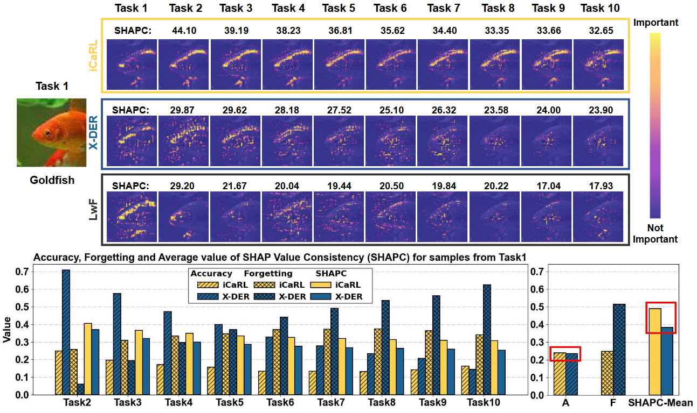
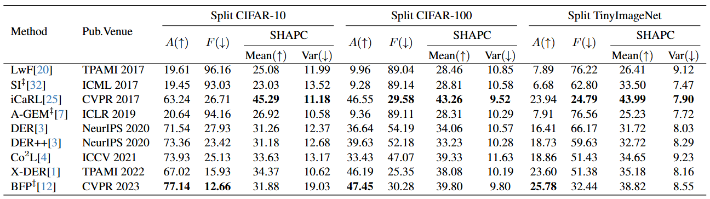

# :page_with_curl: LoRA-Based Continual Learning with Constraints on Critical Parameter Changes

This is the *Pytorch Implementation* for the paper:

> **Is Our Continual Learner Reliable? Investigating Its Decision Attribution
Stability through SHAP Value Consistency** <br>Yusong Cai,Shimou Ling, Liang Zhang, Lili Pan, Hongliang Li <br>
> 2024CVPRW

> **Abstract**:  In this work, we identify continual learning (CL) methods' inherent differences in sequential decision attribution. 
In the sequential learning process, inconsistent decision attribution may undermine the interpretability of a continual learner. 
However, existing CL evaluation metrics, as well as current interpretability methods, cannot measure the decision attribution stability of a continual learner. 
To bridge the gap, we introduce Shapley value, a well-known decision attribution theory, and define SHAP value consistency (SHAPC) to measure the consistency of a continual learner's decision attribution.
 Furthermore, we define the mean and the variance of SHAPC values, namely SHAPC-Mean and SHAPC-Var, to jointly evaluate the decision attribution stability of continual learners over sequential tasks. 
On Split CIFAR-10, Split CIFAR-100, and Split TinyImageNet, we compare the decision attribution stability of different CL methods using the proposed metrics, providing a new perspective for evaluating their reliability. 

<div align=center>

</div>

## 🔧 Dependencies and Installation
**Depedencies**
* Python >= 3.7 (Recommend to use [Anaconda](https://www.anaconda.com/download/#linux) or [Miniconda](https://docs.conda.io/en/latest/miniconda.html))
* Pytorch 1.9.1 or later. See [Pytorch]( https://pytorch.org) for install instructions.
* Linux (Ubuntu 20.04.3)

**Installation**

First, you can clone this repo using the command:

```shell 
git clone https://github.com/learninginvision/SHAPC
```

Then, you can create a virtual environment using conda, as follows:

```shell
conda env create -f environment.yaml
conda activate shapc
```

## :floppy_disk: Data preparation
We provide source about the datasets we use in our experiment as below:

| Dataset   | Dataset file                                                 |
| --------- | ------------------------------------------------------------ |
| CIFAR-10| [DomainNet]( http://www.cs.toronto.edu/~kriz/cifar-10-python.tar.gz) |
| CIFAR-100  | [CIFAR-100](http://www.cs.toronto.edu/~kriz/cifar-100-python.tar.gz) |
| TinyImageNet | [TinyImageNet](https://unimore365-my.sharepoint.com/:u:/g/personal/263133_unimore_it/EVKugslStrtNpyLGbgrhjaABqRHcE3PB_r2OEaV7Jy94oQ?e=9K29aD) |


##  💻 Training
Run the following command to train the model sequentially:


```shell
CUDA_VISIBLE_DEVICES=0 python train.py --config configs/<yaml>.yaml
```
- `<yaml>`: The config file(e.g. `configs/icarl_cifar10.yaml`)

After training, you can get model checkpoints in the folder `./data/results`.

## 📊 Evaluation
After completing training, the model's performance can be tested using the following command:


Accuracy test
```shell
bash acc_test.sh
```
SHAPC calculation
```shell
CUDA_VISIBLE_DEVICES=0 python shap_conv_cal.py --model <model_name> --dataset <datesets_name>
```
- `<model_name>`: The name of the model. (e.g. `icarl,der,si`)
- `<datesets_name>`: The name of the datasets. (e.g. `seq-cifar10,seq-cifar100,seq-tinyimg`)

The result will be saved in the folder `./shapley_value_conv/<datesets_name>/<model_name>`.

SHAPC-Mean SHAPC-Var calculation
```shell
python SHAPC_cal.py --model <model_name> --dataset <datesets_name>
```
## 📈 Results

<div align="center">


*Results on Split CIFAR-10, Split CIFAR-100 and Split TinyImageNet.*
</div>

## 📜 Acknowledgments

This code is built upon [mammoth](https://aimagelab.github.io/mammoth/),[shap](https://shap.readthedocs.io/en/latest/index.html)


We thank the authors for releasing their code.